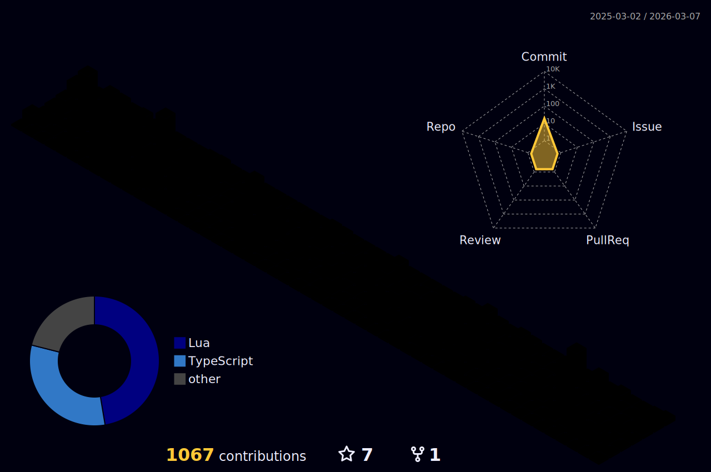

    

    

 
 

<h2 align="center">♑ About me</h2> 

- I am presently immersing myself further into **Python** and **Rust**, exploring their applications in *web development*, *machine learning*, *automation*, and the development of *more sophisticated software solutions*.

- I am committed to continuous improvement, constantly expanding my knowledge by devouring **books**, scouring for **new sources**, and delving into **technical articles**, assimilating all this content into my [second brain](https://fortelabs.com/blog/basboverview/) at [Obsidian](https://obsidian.md/), for constant revisions. I have a big passion in the realms of *information security* and *machine learning*, with a *particular fascination for command line applications (CLI*).

<h2 align="center">🛠️ Tools</h2> 

 <kbd>
      <kbd>Operating System</kbd>
       
       
        
        
        
        
    </kbd>
       
       
    <kbd>
      <kbd>Programming & Markup Languages</kbd>
       
       
        
        
        
        
        
        
        
        
    </kbd>
       
       
    <kbd>
      <kbd>Frameworks & Other Techs</kbd>
       
       
        
        
        
        
        
        
        
    </kbd>
    <kbd>
       
       
      <kbd>Database</kbd>
       
       
      
      
      
    </kbd>
       

 

<h2 align="center">📈 Github Profile Stats</h2>

    <a href="https://github.com/d-hcosta">
        
        
    </a>

 

<h2 align="center">📬 Contact</h2>

    
    

